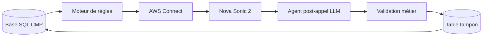

# AGENTS.md

Agent vocal de confirmation de livraison CMP, construit sur AWS Connect + Nova Sonic 2, avec analyse post-appel par LLM et mise à jour SQL contrôlée.

## Architecture

- `src/rules/` — moteur de règles métier (sélection des commandes, génération des fiches d'appel)
- `src/connect/` — intégration AWS Connect (déclenchement des appels sortants)
- `src/voice/` — configuration de l'agent vocal Nova Sonic 2
- `src/analysis/` — agent d'analyse post-appel (LLM texte sur transcript)
- `src/validation/` — couche de validation métier (règles déterministes avant écriture SQL)
- `src/db/` — accès SQL CMP (lecture commandes, écriture résultats)
- `terraform/` — infrastructure AWS (Connect, Lambda, S3, RDS/SQL)

## Environment

- Python ≥ 3.10
- Activer le venv : `source .venv/bin/activate`
- Installer les dépendances : `pip install -r requirements.txt`
- Config env : `cp .env.example .env` puis éditer

## Région AWS cible

- **Région de déploiement : `eu-north-1` (Stockholm)** pour ce POC et pour la solution finale CMP.
- Nova Sonic 2 (`amazon.nova-sonic-v1:0`) fonctionne correctement en `eu-north-1` — utiliser cette région pour tous les appels Bedrock Nova Sonic.
- `AWS_DEFAULT_REGION=eu-north-1` doit être défini dans `.env` et dans tous les scripts/Terraform.

## AWS accounts & auth

- **Compte dev personnel (Arnaud)** : compte AWS personnel utilisé pour le développement itératif du runtime AWS uniquement. Accès complet ; auth via `aws login`. Déploiement via `scripts/deploy.sh` (Docker build → ECR → Terraform avec `terraform/env/personal.tfvars`).
- **Compte client CMP** : compte AWS preprod/prod CMP. **Pas d'usage AWS direct depuis les machines locales** : pas de CLI AWS, pas de console, pas de `terraform apply/plan`, pas d'inspection de logs. Le seul chemin autorisé pour modifier l'AWS client est de pousser du code/config sur CodeCatalyst CI. Pour la validation, s'appuyer uniquement sur les résultats CI et les effets visibles côté métier (table tampon, statuts SQL).
- Ne pas configurer `AWS_PROFILE=client` pour le travail local. Utiliser le compte personnel pour le runtime perso ; utiliser un environnement local ou les effets SQL visibles pour la validation métier.
- Quand `AWS_ACCESS_KEY_ID` est défini dans `.env`, `AWS_PROFILE` est ignoré (credentials explicites prioritaires).

## Flux de traitement

Phases :
1. **Préparation** — lecture SQL → règles métier → fiche d'appel → `pending_call`
2. **Appel** — AWS Connect → Nova Sonic 2 → transcript + résultat brut
3. **Analyse** — LLM post-appel → résultat structuré + `confidence_score`
4. **Mise à jour** — validation déterministe → table tampon → SQL si conditions remplies, sinon `human_review_required`

Le principe clé est de ne jamais écrire en SQL directement depuis l'agent vocal. L'écriture passe toujours par l'agent d'analyse post-appel + la couche de validation + la table tampon.

## Definition of Done

Un changement est "terminé" uniquement quand :
- L'implémentation correspond au comportement demandé.
- Le diff est minimal (pas de refactors ornementaux).
- Les vérifications pertinentes ont été lancées et sont passées.
- Ce qui a été lancé et tout résultat notable sont reportés.

## Commands

- Lint : `ruff check .`
- Format : `ruff format .`
- Typecheck : `mypy .`
- Tests : `pytest -q`
- Test connexions AWS/SQL : `python3 -m scripts.test_connections`
- Déploiement runtime personnel : `scripts/deploy.sh` (Docker build → ECR → Terraform)
- Smoke test preprod : `make smoke-test` (`WEBHOOK_URL` pointe vers preprod client par défaut)

## Safety

- Ne jamais exécuter d'opérations destructives contre les systèmes ou données de production.
- Ne jamais dropper/supprimer/tronquer des tables ou collections par défaut.
- Si un changement destructif est explicitement requis : produire un plan de migration + plan de rollback + étapes de validation en staging, puis s'arrêter pour confirmation explicite.
- **Le code destructif doit être écrit commenté** avec un marqueur `# REVIEW:`. Seules les lignes mutantes (drop, delete, truncate, insert_many, update_many, bulk mutations) sont commentées — la logique environnante est écrite normalement. L'utilisateur reviewe et décommente.
- Les credentials vivent dans `.env` (jamais commités).

## Repositories & CI

- **origin** (GitHub) : `https://github.com/ArnaudGardille/agent-cmp-voice` — remote de développement principal.
- **codecatalyst** (AWS CodeCatalyst) : remote de déploiement client.
- Pousser sur CodeCatalyst master déclenche le pipeline preprod : `git push codecatalyst HEAD:master`
- Workflow CI : `.codecatalyst/workflows/deploy-preprod.yaml` — lance `terraform apply` avec `terraform/env/preprod.tfvars` + secrets depuis `PREPROD_SECRETS_B64` sur l'environnement `preprod`.
- Ne jamais tenter de valider la preprod client via des commandes AWS directes. Valider uniquement via le statut CI et les effets métier observables (table tampon, statuts SQL).

## Terraform & modèle de déploiement

- Le développement local utilise un environnement SQL local ou de test.
- Les déploiements AWS partagent la même config Terraform dans `terraform/` :
  - **Personnel (dev)** : `terraform/env/personal.tfvars`. Accès complet — `terraform apply` local possible pour le runtime/infra perso.
  - **Client (preprod)** : `terraform/env/preprod.tfvars` + secrets injectés via CodeCatalyst `PREPROD_SECRETS_B64`. **Pas d'accès AWS local** — Terraform ne peut être appliqué que via le pipeline CI.
- Pour changer l'infra client : éditer `preprod.tfvars` (ou le code), commiter, `git push codecatalyst HEAD:master`.

## Docs

- Ne pas créer de nouvelle documentation sauf si demandé.
- Mettre à jour la documentation existante uniquement quand le comportement ou les APIs publiques changent, et limiter les changements au minimum.
