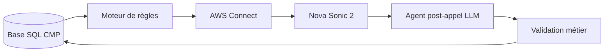

# agent-cmp-voice

Agent vocal de confirmation de livraison CMP — appels sortants automatisés via AWS Connect + Nova Sonic 2, avec analyse post-appel par LLM et mise à jour SQL contrôlée.



Specs détaillées : [`doc/spec-user.md`](doc/spec-user.md) · [`doc/spec-tech.md`](doc/spec-tech.md)

## Setup

```bash
cp .env.example .env          # puis renseigner les variables
python -m venv .venv && source .venv/bin/activate
pip install -r requirements.txt
```

## Commandes

```bash
ruff check .                          # lint
ruff format .                         # format
mypy .                                # typecheck
pytest -q                             # tests
python3 -m scripts.test_connections   # test connexions AWS/SQL
```

## Déploiement

**Runtime personnel (dev)**
```bash
scripts/deploy.sh   # Docker build → ECR → Terraform (personal.tfvars)
```

**Preprod client**
```bash
git push codecatalyst HEAD:master   # déclenche le pipeline CI
```
