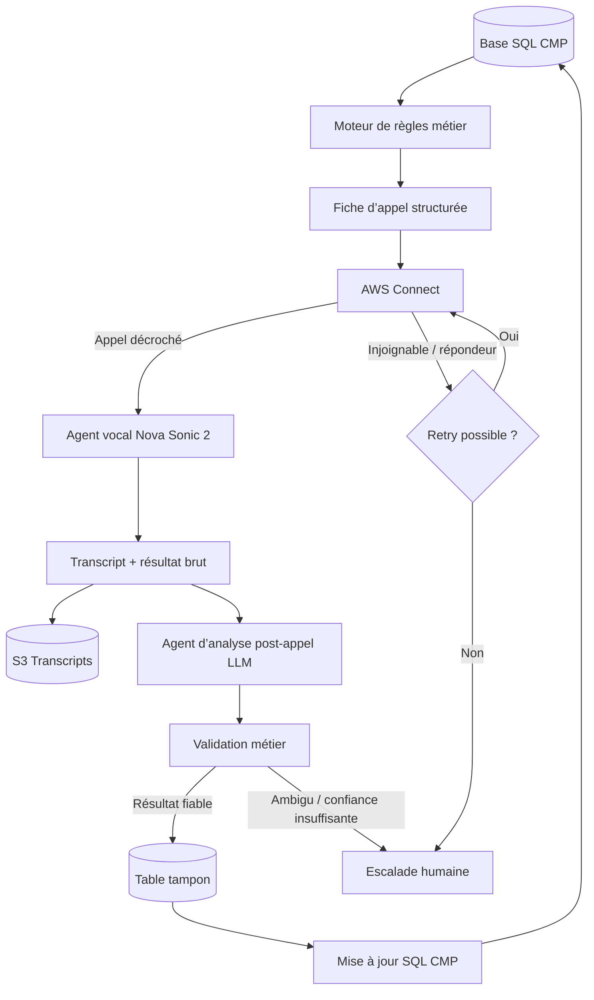
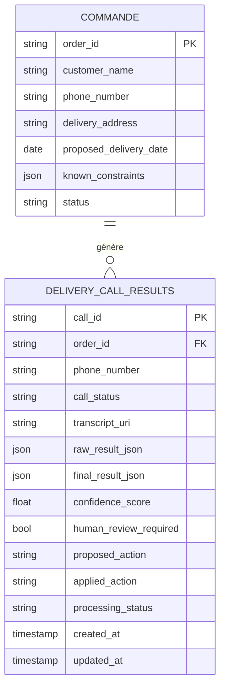
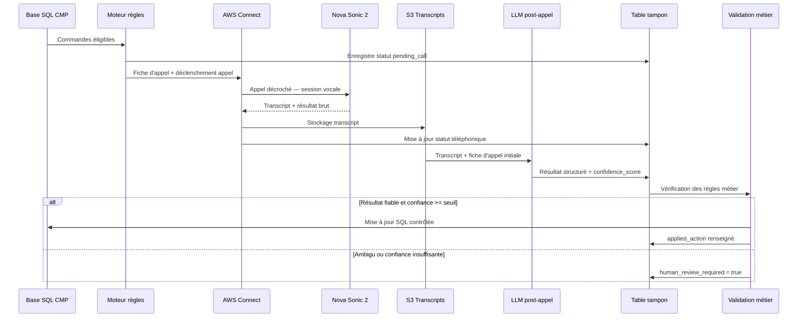
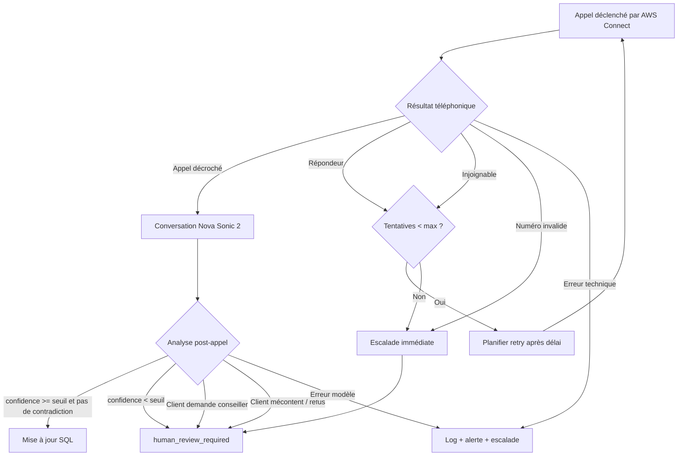

# Spécification technique — Architecture de l’agent vocal CMP

## 1. Objectif technique

La solution vise à automatiser les appels de confirmation de livraison CMP en combinant :

- un moteur de règles métier ;
- une couche téléphonique AWS Connect ;
- un agent vocal speech-to-speech basé sur Nova Sonic 2 ;
- un traitement post-appel par LLM ;
- une couche de validation et de mise à jour SQL.

Le principe clé est de séparer clairement :

1. la décision métier avant l’appel ;
2. la conversation vocale pendant l’appel ;
3. l’analyse et la mise à jour après l’appel.

Cette séparation permet de limiter les risques, de rendre les traitements auditables et d’éviter qu’un agent vocal écrive directement en base pendant une conversation client.

## 2. Vue d’ensemble de l’architecture



## 3. Composants principaux

### 3.1 Base SQL CMP

#### Rôle

La base SQL CMP contient les données nécessaires à la préparation des appels et reçoit les résultats après traitement.

#### Données lues

- commandes à livrer ;
- clients ;
- numéros de téléphone ;
- adresses ;
- dates de livraison proposées ;
- statuts de commande ;
- contraintes logistiques connues.

#### Données écrites

- statut de l’appel ;
- date confirmée ;
- contraintes confirmées ou détectées ;
- résumé d’appel ;
- besoin d’escalade ;
- statut de traitement ;
- trace d’audit.

### 3.2 Moteur de règles métier

#### Rôle

Le moteur de règles sélectionne les commandes à appeler et prépare le contexte nécessaire à l’agent vocal.

#### Responsabilités

- identifier les commandes éligibles ;
- déterminer la date minimale ou proposée de livraison ;
- choisir le numéro à appeler ;
- préparer les questions à poser ;
- déterminer les règles de retry ;
- préparer les consignes d’escalade ;
- générer une fiche d’appel structurée.

#### Exemple de sortie

```json
{
  "call_id": "CALL-20260514-0001",
  "order_id": "CMD-12345",
  "customer_name": "Client X",
  "phone_number": "+33600000000",
  "delivery_address": "12 rue Exemple, 75000 Paris",
  "proposed_delivery_date": "2026-05-14",
  "known_constraints": {
    "tail_lift_required": true,
    "small_truck_required": false,
    "access_comment": "Livraison centre-ville"
  },
  "call_objectives": [
    "confirm_availability",
    "confirm_delivery_date",
    "confirm_address",
    "confirm_access_constraints"
  ]
}
```

#### Points à préciser

- règles exactes d’éligibilité ;
- nombre de tentatives ;
- délai entre deux tentatives ;
- horaires autorisés ;
- priorisation des appels ;
- règles de passage en revue humaine.

### 3.3 AWS Connect

#### Rôle

AWS Connect assure la partie téléphonique.

#### Responsabilités

- émettre les appels sortants ;
- gérer le numéro d’appel ;
- connecter l’appel à l’agent vocal ;
- remonter les statuts techniques ;
- permettre la gestion des appels non répondus ou échoués.

#### Sorties attendues

- appel répondu ;
- appel non répondu ;
- répondeur ;
- numéro invalide ;
- erreur technique ;
- durée d’appel ;
- identifiant de contact.

### 3.4 Agent vocal Nova Sonic 2

#### Rôle

Nova Sonic 2 gère la conversation vocale en temps réel avec le client.

#### Responsabilités

- comprendre la voix du client ;
- répondre vocalement ;
- suivre le script métier ;
- reformuler les informations importantes ;
- détecter les incompréhensions ;
- détecter les demandes d’escalade ;
- produire un transcript ;
- produire un premier résultat brut structuré.

#### Script conversationnel cible

1. Présentation de l’agent.
2. Explication de l’objet de l’appel.
3. Confirmation de la commande ou de la livraison.
4. Confirmation de la disponibilité.
5. Confirmation ou ajustement de la date.
6. Confirmation de l’adresse.
7. Vérification des contraintes d’accès.
8. Vérification du besoin de hayon ou camion adapté.
9. Reformulation finale.
10. Clôture ou escalade.

#### Sortie brute attendue

```json
{
  "call_id": "CALL-20260514-0001",
  "call_status": "completed",
  "raw_summary": "Le client confirme une disponibilité le 15 mai. Adresse correcte. Camion léger nécessaire.",
  "raw_extracted_data": {
    "client_available": true,
    "confirmed_delivery_date": "2026-05-15",
    "address_confirmed": true,
    "tail_lift_required": true,
    "small_truck_required": true,
    "access_issue_detected": true
  },
  "transcript_uri": "s3://bucket/transcripts/CALL-20260514-0001.json"
}
```

### 3.5 Stockage transcript

#### Rôle

Le transcript est conservé pour analyse, audit et amélioration continue.

#### Données stockées

- identifiant d’appel ;
- horodatage ;
- transcript complet ;
- résultat brut de l’agent vocal ;
- métadonnées techniques ;
- durée de l’appel ;
- statut téléphonique.

#### Remarque

Le stockage audio complet n’est pas requis pour le MVP. Il peut être ajouté plus tard si CMP souhaite faire de l’audit qualité avancé, avec les implications RGPD et client associées.

### 3.6 Agent d’analyse post-appel

#### Rôle

Un LLM texte analyse le transcript et le contexte initial afin de produire une décision métier fiable.

#### Entrées

- fiche d’appel initiale ;
- transcript complet ;
- résultat brut de Nova Sonic 2 ;
- données métier utiles ;
- règles de validation.

#### Responsabilités

- extraire les informations finales ;
- vérifier la cohérence avec le contexte initial ;
- détecter les contradictions ;
- produire un résumé fiable ;
- calculer un niveau de confiance ;
- proposer une action métier ;
- décider si une revue humaine est nécessaire.

#### Exemple de sortie

```json
{
  "call_id": "CALL-20260514-0001",
  "order_id": "CMD-12345",
  "final_status": "confirmed_with_constraints",
  "delivery_date_to_update": "2026-05-15",
  "address_confirmed": true,
  "address_update_required": false,
  "tail_lift_required": true,
  "small_truck_required": true,
  "human_review_required": false,
  "confidence_score": 0.94,
  "business_summary": "Livraison confirmée pour le 15 mai. Prévoir camion léger avec hayon."
}
```

#### Modèle cible

Le modèle exact pourra être arbitré pendant le cadrage ou le MVP :

- Claude Sonnet ;
- Nova Lite ;
- autre modèle texte compatible.

Le choix dépendra du coût, de la qualité d’extraction, de la latence et de la préférence d’industrialisation.

### 3.7 Couche de validation métier

#### Rôle

La couche de validation applique des règles déterministes avant toute mise à jour SQL.

#### Exemples de contrôles

- la date confirmée est-elle valide ?
- la date est-elle compatible avec la date minimale de livraison ?
- le score de confiance est-il suffisant ?
- le client a-t-il confirmé explicitement ?
- une contradiction a-t-elle été détectée ?
- une revue humaine est-elle nécessaire ?
- le statut permet-il une mise à jour automatique ?

#### Principe

Le LLM propose une sortie structurée. Le code métier décide si cette sortie peut être appliquée.

### 3.8 Table tampon de résultats

#### Rôle

Avant toute mise à jour définitive, les résultats sont stockés dans une table tampon.

#### Structure de données



#### Exemple de table

```sql
delivery_call_results
- call_id
- order_id
- phone_number
- call_status
- transcript_uri
- raw_result_json
- final_result_json
- confidence_score
- human_review_required
- proposed_action
- applied_action
- processing_status
- created_at
- updated_at
```

#### Bénéfices

- auditabilité ;
- rejouabilité ;
- correction manuelle ;
- debug ;
- traçabilité des décisions ;
- séparation entre résultat d’appel et écriture métier définitive.

### 3.9 Mise à jour SQL

#### Rôle

Une fois les validations passées, la base SQL CMP est mise à jour.

#### Exemples de mises à jour

- statut de confirmation ;
- date confirmée de livraison ;
- contraintes logistiques ;
- commentaire de synthèse ;
- statut d’escalade ;
- date de dernier contact.

#### Principe

La mise à jour SQL est réalisée par une couche applicative contrôlée, pas directement par le modèle.

## 4. Flux de traitement détaillé



### 4.1 Préparation

1. Lecture des commandes éligibles dans la base SQL.
2. Application des règles métier.
3. Création d’une fiche d’appel.
4. Enregistrement d’un statut `pending_call`.

### 4.2 Appel

1. AWS Connect déclenche l’appel.
2. Le client répond ou non.
3. Si le client répond, Nova Sonic 2 mène la conversation.
4. Le transcript et le résultat brut sont produits.
5. Le statut technique de l’appel est enregistré.

### 4.3 Analyse

1. Le transcript est envoyé au LLM post-appel.
2. Le LLM analyse le transcript et le contexte.
3. Il produit un résultat métier structuré.
4. La couche de validation vérifie la cohérence.

### 4.4 Mise à jour

1. Le résultat est enregistré en table tampon.
2. Si le résultat est fiable, la base métier est mise à jour.
3. Si le résultat est ambigu, le dossier est marqué pour revue humaine.
4. Si l’appel a échoué, une règle de retry ou d’escalade est appliquée.

## 5. Données d’entrée

### Données obligatoires

- identifiant commande ;
- numéro de téléphone ;
- nom client ou raison sociale ;
- adresse de livraison ;
- date proposée ou date minimale ;
- statut de commande ;
- informations logistiques connues.

### Données optionnelles

- contact secondaire ;
- horaires préférés ;
- contraintes historiques ;
- commentaire transport ;
- type de véhicule prévu ;
- besoin de hayon connu ;
- langue préférée ;
- historique d’appels.

## 6. Données de sortie

### Sorties métier

- statut final ;
- date confirmée ;
- contraintes confirmées ;
- résumé d’appel ;
- indicateur de revue humaine ;
- action proposée ;
- action appliquée.

### Sorties techniques

- identifiant d’appel ;
- statut téléphonique ;
- durée d’appel ;
- transcript ;
- résultat brut ;
- résultat analysé ;
- logs d’exécution ;
- erreurs éventuelles.

## 7. Gestion des erreurs et exceptions



### Cas à gérer

- client injoignable ;
- répondeur ;
- numéro invalide ;
- appel interrompu ;
- client mécontent ;
- demande de conseiller humain ;
- réponse ambiguë ;
- contradiction avec les données CMP ;
- erreur AWS Connect ;
- erreur modèle ;
- erreur SQL.

### Comportement attendu

- aucun échec ne doit être silencieux ;
- chaque appel doit avoir un statut final ;
- les cas ambigus doivent être remontés ;
- les erreurs techniques doivent être journalisées ;
- les mises à jour SQL doivent être idempotentes.

## 8. Périmètre technique du MVP

### Inclus dans le scope

- connexion à la base SQL CMP ;
- sélection des commandes à appeler ;
- moteur de règles simple ;
- génération de fiches d’appel ;
- appels sortants via AWS Connect ;
- agent vocal Nova Sonic 2 ;
- transcript d’appel ;
- analyse post-appel par LLM ;
- table tampon de résultats ;
- validation métier ;
- mise à jour SQL contrôlée ;
- gestion simple des retries ;
- escalade humaine simple ;
- logs et monitoring minimal.

### Hors scope MVP

- transfert live complet vers un humain ;
- centre d’appel avancé ;
- analytics conversationnels avancés ;
- dashboard BI complet ;
- optimisation des tournées ;
- orchestration transport avancée ;
- stockage audio systématique ;
- multilingue avancé ;
- intégration ERP complète bidirectionnelle ;
- moteur de règles no-code administrable par métier ;
- haute disponibilité multi-région.

## 9. Critères d’acceptation techniques

Le MVP sera considéré comme techniquement valide si :

- une commande éligible peut être sélectionnée automatiquement ;
- une fiche d’appel complète est générée ;
- AWS Connect déclenche l’appel ;
- Nova Sonic 2 mène une conversation compréhensible ;
- un transcript est généré ;
- le LLM post-appel produit une sortie structurée ;
- les règles de validation sont appliquées ;
- la base SQL est mise à jour uniquement si les conditions sont remplies ;
- les cas ambigus sont escaladés ;
- chaque appel dispose d’un statut final traçable ;
- les erreurs sont journalisées.

## 10. Points ouverts à cadrer

Les éléments suivants devront être précisés pendant la phase de cadrage :

- structure exacte des tables SQL CMP ;
- format final des données à écrire ;
- règles métier détaillées ;
- règles de retry ;
- seuil de confiance minimum ;
- critères d’escalade ;
- modèle LLM final pour l’analyse post-appel ;
- politique de conservation des transcripts ;
- besoin de stockage audio ;
- contraintes RGPD ;
- volumétrie cible ;
- pics d’activité attendus ;
- niveau de monitoring attendu.
