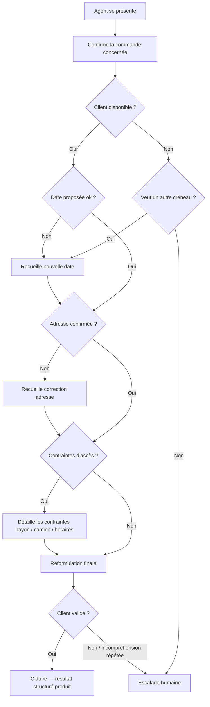
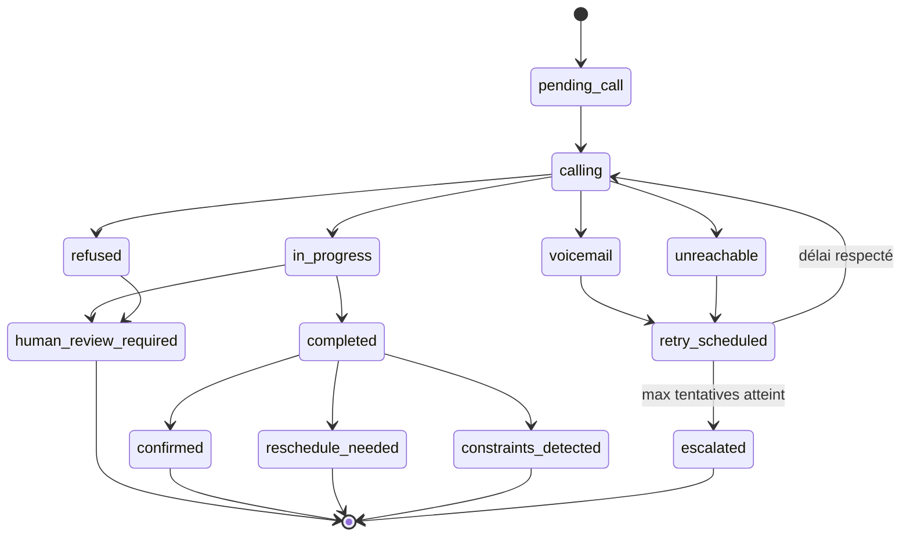

# Spécification utilisateur — Agent vocal de confirmation de livraison CMP

## 1. Contexte

CMP réalise des livraisons fréquentes auprès de ses clients. Avant certaines livraisons, les équipes doivent contacter les clients afin de confirmer plusieurs informations opérationnelles : disponibilité, date de livraison, adresse, contraintes d’accès, besoin de hayon ou type de camion adapté.

Aujourd’hui, ces appels sont réalisés par des opérateurs humains. Cette activité est coûteuse, répétitive et difficile à absorber lors des pics d’activité, notamment en période de forte charge.

L’objectif est de mettre en place un agent vocal capable d’appeler automatiquement les clients pour traiter les cas simples de confirmation de livraison, tout en prévoyant une escalade humaine pour les cas ambigus ou sensibles.

## 2. Objectif métier

L’objectif du projet est de réduire la charge opérationnelle des équipes CMP en automatisant les appels de confirmation de livraison simples.

La solution doit permettre de :

- confirmer la disponibilité du client ;
- confirmer ou ajuster la date de livraison ;
- confirmer l’adresse de livraison ;
- vérifier les contraintes d’accès au lieu de livraison ;
- identifier les besoins logistiques spécifiques : hayon, camion léger, accès difficile, horaires particuliers ;
- restituer un résultat clair et exploitable par les équipes CMP ;
- escalader les cas non conclusifs vers un humain.

## 3. Utilisateurs concernés

### Utilisateurs internes CMP

- Équipes d’expédition ;
- Équipes transport / logistique ;
- Service client ;
- Responsables opérationnels.

### Utilisateur externe

- Client final appelé par l’agent vocal.

Le client final ne dispose pas d’une interface dédiée. Il interagit uniquement par téléphone avec l’agent vocal.

## 4. Parcours utilisateur cible

### 4.1 Parcours côté CMP

1. Les commandes nécessitant une confirmation sont identifiées.
2. Le système prépare les informations nécessaires à l’appel.
3. L’agent vocal appelle le client.
4. Le client répond aux questions de confirmation.
5. Le système produit un résultat structuré.
6. Les informations exploitables sont mises à jour dans la base CMP.
7. Les cas ambigus sont transmis à un humain.

### 4.2 Parcours côté client appelé

1. Le client reçoit un appel téléphonique.
2. L’agent vocal se présente et explique l’objet de l’appel.
3. L’agent confirme la livraison concernée.
4. L’agent pose les questions nécessaires :
   - disponibilité ;
   - date de livraison ;
   - adresse ;
   - contraintes d’accès ;
   - besoin de hayon ou de camion adapté.
5. L’agent reformule les informations comprises.
6. L’appel est clôturé ou transmis à un humain si nécessaire.



## 5. Données d’entrée attendues

Pour chaque appel, le système doit disposer au minimum des données suivantes :

- identifiant de commande ;
- nom du client ;
- numéro de téléphone ;
- adresse de livraison ;
- date minimale ou proposée de livraison ;
- informations logistiques connues ;
- contraintes client déjà enregistrées ;
- statut de la commande ;
- éventuelles consignes métier CMP.

Exemple de fiche d’appel :

```json
{
  "order_id": "CMD-12345",
  "customer_name": "Client X",
  "phone_number": "+33600000000",
  "delivery_address": "12 rue Exemple, 75000 Paris",
  "proposed_delivery_date": "2026-05-14",
  "known_constraints": {
    "tail_lift_required": true,
    "small_truck_required": false
  }
}
```

## 6. Informations à collecter pendant l’appel

L’agent vocal doit chercher à confirmer ou collecter les informations suivantes :

- le client est-il disponible pour recevoir la livraison ?
- la date proposée convient-elle ?
- une autre date est-elle nécessaire ?
- l’adresse est-elle correcte ?
- un camion peut-il accéder au lieu de livraison ?
- un hayon est-il nécessaire ?
- un camion léger est-il requis ?
- existe-t-il une contrainte particulière : horaires, rue étroite, portail, quai, contact sur place ?
- le client demande-t-il à être rappelé par un humain ?

## 7. Résultat attendu après chaque appel

Chaque appel doit produire un résultat métier clair, structuré et exploitable.

### Cycle de vie d'un appel



### Statuts possibles

- `confirmed` : livraison confirmée ;
- `reschedule_needed` : date à modifier ;
- `constraints_detected` : contrainte logistique détectée ;
- `unreachable` : client injoignable ;
- `voicemail` : répondeur ;
- `invalid_number` : numéro invalide ;
- `refused` : client refuse l’échange ;
- `human_review_required` : reprise humaine nécessaire ;
- `technical_error` : erreur technique.

### Exemple de sortie attendue

```json
{
  "call_status": "confirmed",
  "confirmed_delivery_date": "2026-05-15",
  "address_confirmed": true,
  "tail_lift_required": true,
  "small_truck_required": true,
  "human_review_required": false,
  "summary": "Client disponible le 15 mai. Adresse confirmée. Prévoir camion léger avec hayon."
}
```

## 8. Règles d’escalade

Le système doit prévoir une escalade humaine dans les cas suivants :

- le client demande explicitement à parler à une personne ;
- le client est mécontent ou refuse d’échanger avec l’agent ;
- l’agent ne comprend pas la réponse après plusieurs tentatives ;
- la réponse du client est contradictoire avec les données connues ;
- une information critique manque ;
- la demande sort du périmètre de la confirmation simple ;
- le score de confiance de l’analyse est insuffisant.

Dans le MVP, l’escalade peut prendre la forme d’un email, d’une tâche ou d’un statut spécifique dans la base. Le transfert téléphonique en direct vers un humain n’est pas obligatoire en première version.

## 9. Périmètre fonctionnel du MVP

### Inclus dans le scope

- identification des commandes à appeler ;
- préparation d’une fiche d’appel ;
- appels sortants automatisés ;
- agent vocal de confirmation ;
- collecte des informations client ;
- génération d’un transcript ;
- génération d’un résumé d’appel ;
- production d’un résultat structuré ;
- mise à jour contrôlée de la base SQL ;
- gestion simple des cas d’échec ;
- escalade humaine simple ;
- journalisation des appels et résultats.

### Hors scope MVP

- optimisation complète des tournées ;
- négociation complexe de créneaux ;
- gestion avancée des transporteurs ;
- transfert live systématique vers un conseiller ;
- centre d’appel complet ;
- analytics avancés de qualité conversationnelle ;
- stockage audio systématique ;
- multi-langue avancé ;
- mise à jour automatique de toutes les fiches ERP ;
- gestion complète des litiges client.

## 10. Critères de succès

Le MVP sera considéré comme réussi si :

- l’agent vocal est compréhensible et suffisamment naturel ;
- les clients comprennent rapidement l’objet de l’appel ;
- les informations principales sont correctement collectées ;
- les résultats sont exploitables par les équipes CMP ;
- les cas ambigus sont bien escaladés ;
- la solution réduit le temps passé par les équipes humaines ;
- l’expérience client reste acceptable ;
- le système fonctionne sur un volume pilote sans surcharge opérationnelle.

## 11. Points à préciser avec CMP

Les éléments suivants devront être cadrés avec les équipes métier :

- volume quotidien d’appels ;
- fenêtres horaires d’appel ;
- nombre maximal de tentatives ;
- règles de rappel ;
- règles exactes de changement de date ;
- règles de mise à jour automatique ;
- seuils d’escalade ;
- politique de conservation des transcripts ;
- besoin ou non de conserver l’audio ;
- format attendu des rapports opérationnels.
